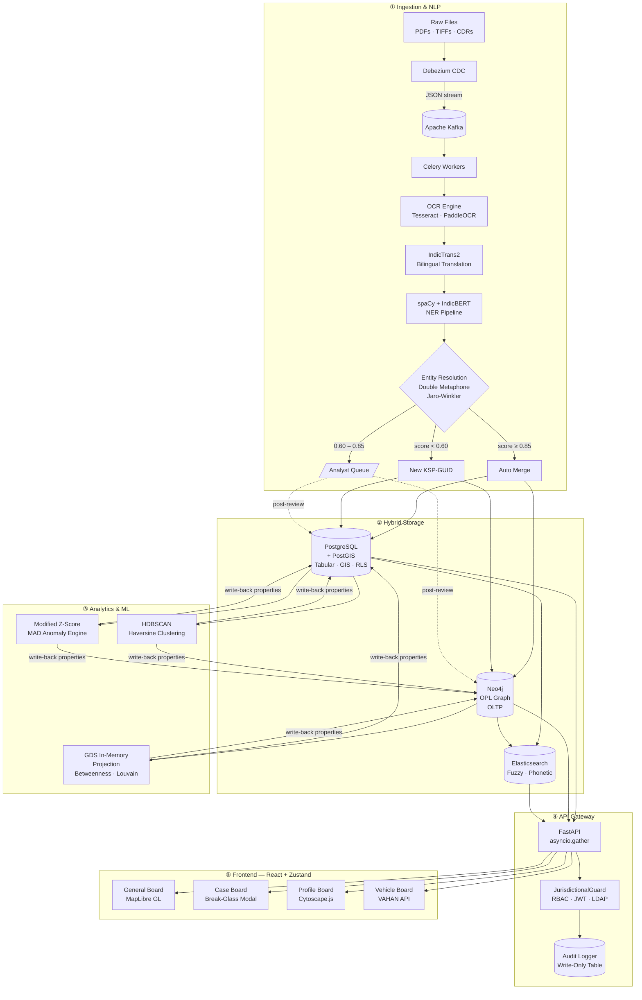
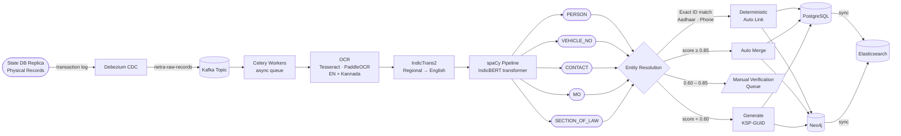
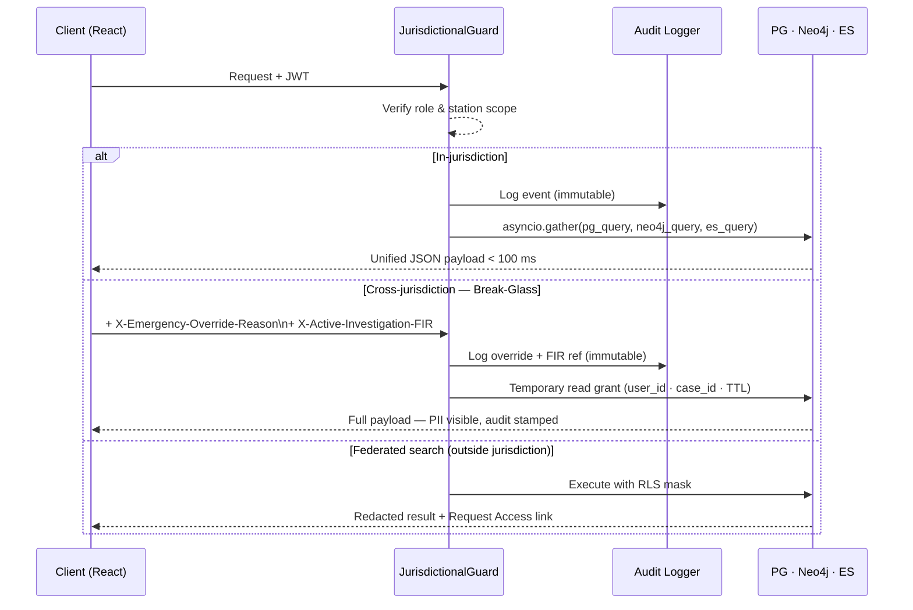
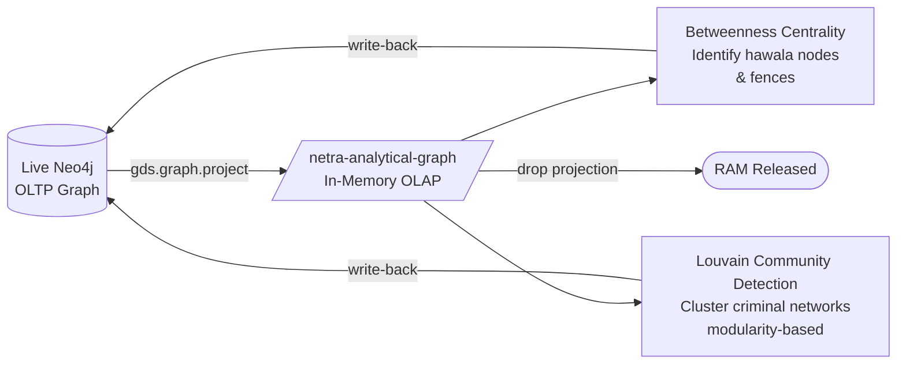
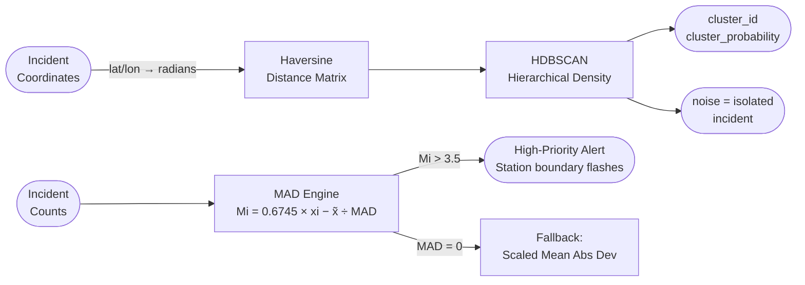

<div align="right"></div>

# NETRA
**Network Evaluation, Trend & Relationship Analytics**

>Secure, open-source, multi-layered intelligence and relationship analytics platform for intelligence agencies, shifting tactical defense from reactive monitoring to audited, proactive operations

[](LICENSE)
[](https://python.org)
[](https://fastapi.tiangolo.com)
[](https://react.dev)
[](https://neo4j.com)

---

## What it does

NETRA unifies fragmented tactical data pipelines into a single audited point of truth across five dedicated layers:

| Layer | Responsibility |
|-------|----------------|
| **1 · Ingestion** | OCR → Translation → NLP → Entity Resolution via Kafka + Celery |
| **2 · Storage** | Hybrid PostgreSQL/PostGIS + Neo4j + Elasticsearch with RLS + AES-256 |
| **3 · Analytics** | GDS in-memory graph projections, HDBSCAN spatial clustering, MAD anomaly detection |
| **4 · API Gateway** | Zero-trust RBAC, jurisdictional enforcement, immutable audit trail |
| **5 · Frontend** | Four-board React SPA — map, case workspace, link explorer, vehicle registry |

---

## System Architecture



---

## Data Ingestion & Resolution Flow



---

## API Request & Access Control Flow



---

## Analytical Engines

### Neo4j GDS — In-Memory Projection



### HDBSCAN Spatial Clustering & MAD Anomaly Detection



---

## Storage & Security Model

| Store | Role | Security |
|-------|------|----------|
| **PostgreSQL + PostGIS** | Transactional record · GIS boundaries · R-Tree index | Row-Level Security · AES-256 PII · Write-only audit table |
| **Neo4j / Apache AGE** | OPL graph — `INVOLVED_IN`, `ASSOCIATED_WITH`, `USED_VEHICLE`, `PRESENT_AT` | Cluster auth · role scoping |
| **Elasticsearch** | Fuzzy + phonetic full-text · < 50 ms state-wide queries | Index-level ACL · TLS in-transit |

---

## Interface
| Board | Purpose | Key Features |
| :--- | :--- | :--- |
| **General Board** | Regional heatmap · Z-score alert overlays | • HDBSCAN density-based incident clustering visualization<br>• Real-time MAD anomaly flashing on station boundaries<br>• Survey of India-compliant boundary correction layers<br>• Live spatial filtering by incident type and time range |
| **Case Board** | FIR workspace · entity highlights · Break-Glass modal | • Interactive NLP entity tagging (person, vehicle, contact, MO)<br>• Integrated regional-to-English translation viewer<br>• "Break-Glass" cross-jurisdiction temporary PII decryption modal<br>• Manual entity resolution queue for review and matching |
| **Profile Board** | Suspect link graph · cross-jurisdiction timeline | • Cytoscape.js canvas with force-directed and radial layouts<br>• GDS Centrality node-sizing and Louvain community coloring<br>• Interactive timeline merging multi-jurisdictional incident logs<br>• Direct dynamic expansion of first- and second-degree associates |
| **Vehicle Board** | VAHAN registry · challan log · state-wide flag history | • Direct VAHAN API real-time registration retrieval<br>• State-wide alerts for blacklisted/wanted vehicle plate matches<br>• Aggregated history of traffic challans and violations<br>• Geographic mapping of vehicle sighting logs |

---

## Project Structure
```
netra/
│
├── backend/
│   ├── alembic/                    # DB Migrations (PostgreSQL)
│   ├── app/                        # Renamed from NETRA_ingestion for broader scope
│   │   ├── __init__.py
│   │   ├── config.py               # Pydantic BaseSettings
│   │   ├── database.py             # DB Session initializers (PG, Neo4j, ES)
│   │   ├── models.py               # SQL Alchemy / Neo4j OGM models
│   │   ├── schemas_api.py          # Pydantic validation schemas
│   │   ├── parsers.py              # OCR & Regional translator pipelines
│   │   ├── nlp_engine.py           # spaCy/IndicBERT NER
│   │   ├── external_api.py         # VAHAN API integrations
│   │   ├── spatial_engine.py       # HDBSCAN and MAD engines
│   │   ├── mo_matcher.py           # Modus Operandi analytics
│   │   ├── graph_analytics.py      # Neo4j GDS projections
│   │   ├── auth.py                 # RBAC and JurisdictionalGuard
│   │   ├── orchestrator.py         # Celery/Kafka worker pipelines
│   │   └── middleware.py           # Audit logging interceptor
│   │
│   ├── routes/                     # Split routes if they grow large
│   │   ├── __init__.py
│   │   └── api.py                  # API endpoints
│   │
│   ├── .env.example                # Template for database credentials/keys
│   ├── main.py                     # FastAPI entry point
│   └── requirements.txt
│
└── frontend/
    ├── package.json
    ├── tailwind.config.js
    ├── postcss.config.js
    ├── index.html
    └── src/
        ├── assets/                 # SVGs and background graphics
        ├── components/
        │   ├── GeneralBoardMap.jsx
        │   ├── LinkExplorer.jsx
        │   └── BreakGlassModal.jsx
        ├── views/
        │   ├── CaseBoard.jsx
        │   ├── ProfileBoard.jsx
        │   └── VehicleBoard.jsx
        ├── main.jsx
        ├── store.js                # Zustand state
        ├── api.js                  # Axios client configuration
        └── App.jsx
```

---

## Performance Targets

| Metric | Target |
|--------|--------|
| Profile Board API response | **< 100 ms** |
| Elasticsearch fuzzy search | **< 50 ms** |
| Kafka ingestion throughput | **10,000 events / min** |

---

## Deployment

- **Transport:** TLS 1.3 enforced on all connections; API behind HAProxy / NGINX in private subnet
- **PostgreSQL:** Master (writes) + read-replicas (reads) multi-node cluster
- **Neo4j:** Multi-instance autonomous cluster for heavy graph workloads
- **Elasticsearch:** 3-node cluster with dedicated master and data roles

---

## License

MIT — see [LICENSE](LICENSE).
NETRA is designed for official law enforcement and defense use. All deployments must comply with applicable data protection, privacy, and national security regulations.
